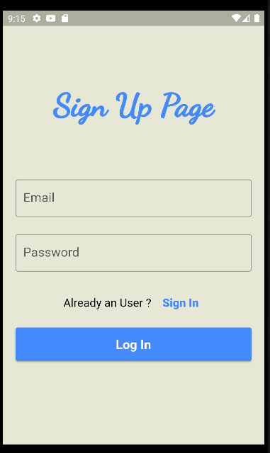
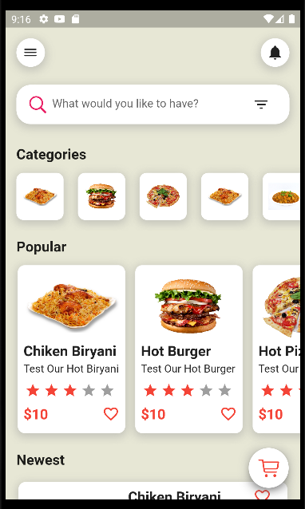
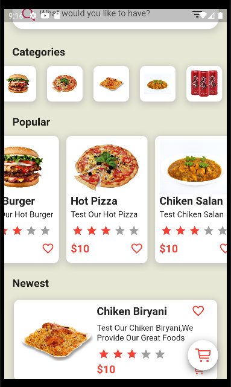
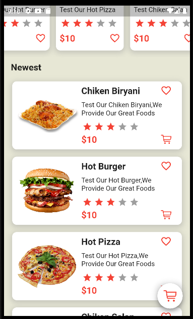
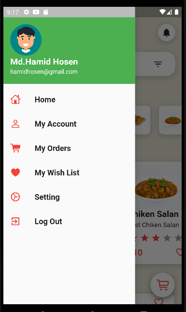
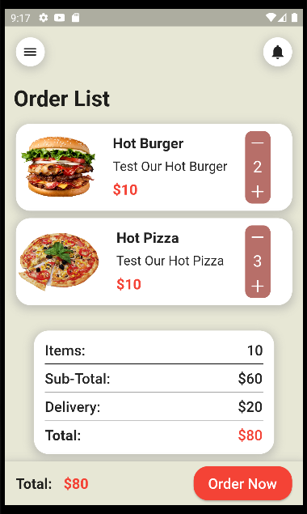
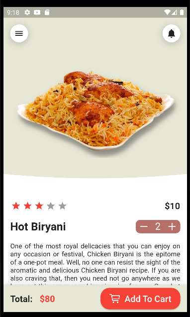
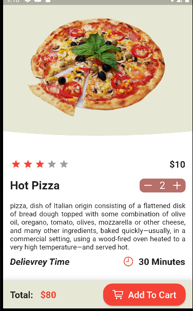
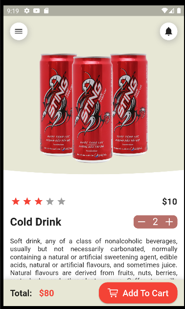

<p align="center"> 
  <tr>
     <td></td>
  </tr>
  <h2 align="center">This is Food Delivery App UI Design<h2>
 </p>
 
 ## Development Setup
Clone the repository and run the following commands:
```
flutter pub get
flutter run
```

### UI Source : https://www.figma.com/file/eO4jQistx2J0VfF5I6v3jH/Food-App?node-id=0%3A1
 
 ## Screenshots
            
